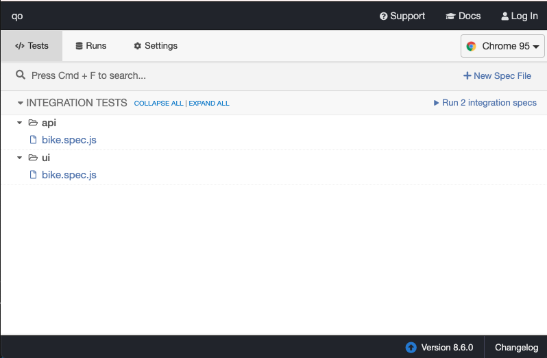
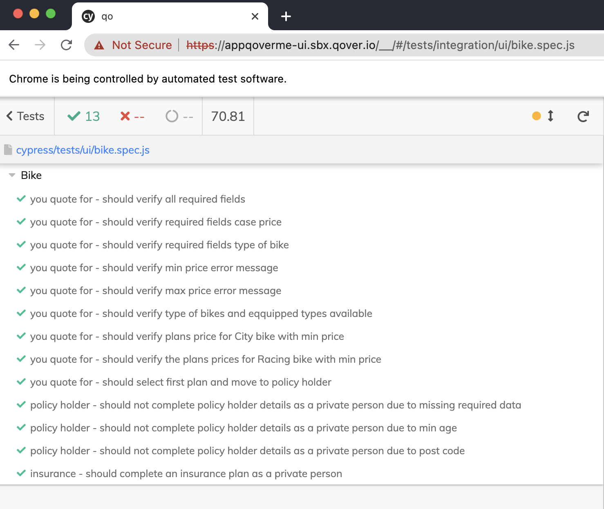
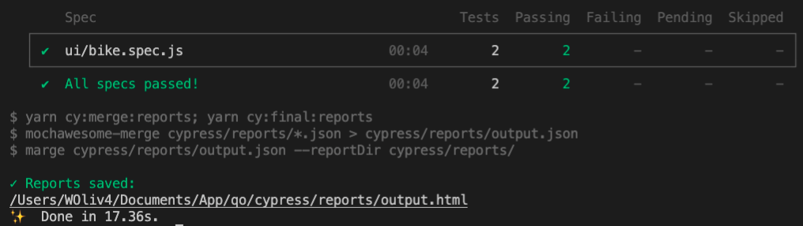
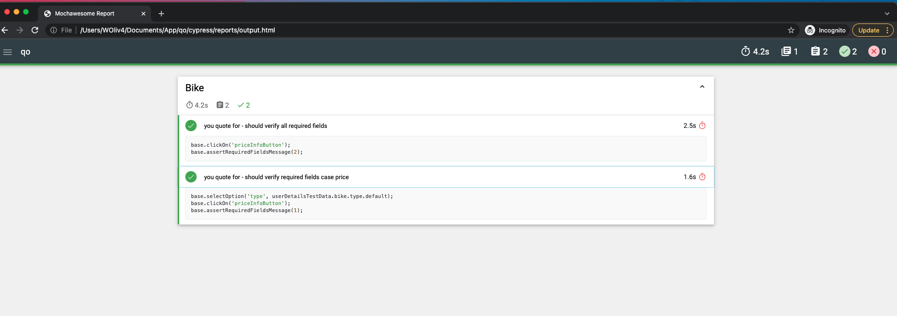
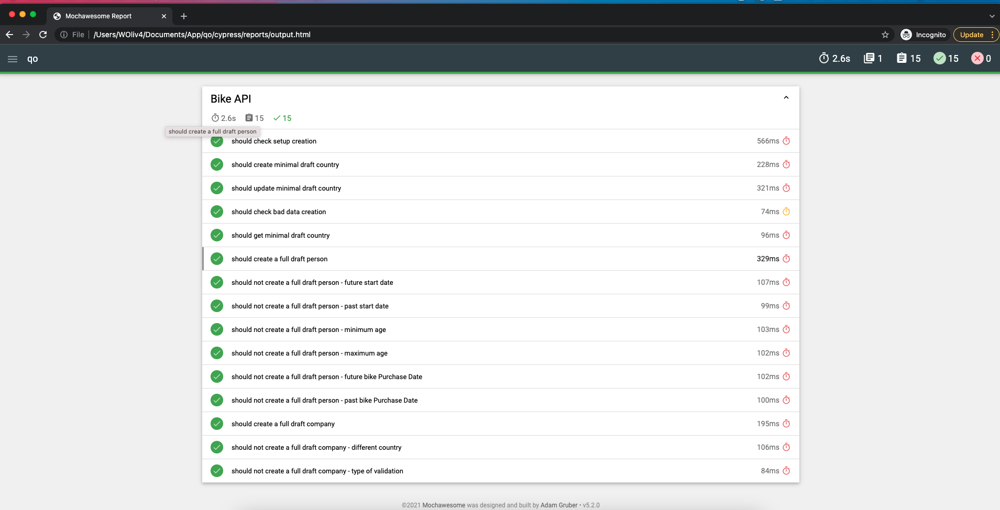
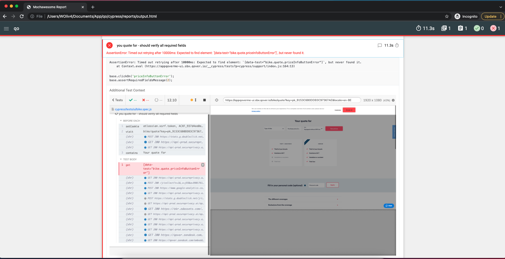

# QOVER Business Case
QOVER Automation business case resolution is using [Cypress](https://www.cypress.io/) as it's testing tool. The API documentation is available [here](https://docs.cypress.io/api/api/table-of-contents.html). So, there are 2 ways of running tests using Cypress either using the UI or using the command line (script mode).

#### How to install this project
First of all it will be necessary to install and check node version in your machine. This is the only pre-requisite to run this project. So, in order to have npm and Node.js installed you can download and read the more instructions in [node] https://nodejs.org/en/download/.

After the completing the installation. Open and go to the terminal for your preference, select the current node version (for this check `.nvmrc`) to see if the current one into your machine is == or >> v14 for example.

> ```bash
> # Selecting the version of this project
> nvm use
> # Checking the version installed
> npm -v
> ```

After the completed node's installation, you will need to clone this current repo.
> ```bash
> # Git Link
> git clone https://github.com/willcoliveira/caseqover.git
> git@github.com:willcoliveira/caseqover.git
> ```

#### Installing the dependencies
After cloning the repository from github. Open the root folder of this project and install the dependecies from the package.json file. This file contains all the necessary dependecies to run, validate, debug and install the automation project. You can use one of the following ways to install it:

> ```bash
> yarn or
> npm install
> ```

If it doesn't work for the first time, you can also install yarn locally and repeat the previous step.
> ```bash
> npm install --global yarn
> ```

You will see the following messages:

> ```bash
> yarn install v1.22.17
> info No lockfile found.
> [1/4] 🔍  Resolving packages...
> [2/4] 🚚  Fetching packages...
> [3/4] 🔗  Linking dependencies...
> [4/4] 🔨  Building fresh packages...
> success Saved lockfile.
> ✨  Done in 19.38s.
> ```

After the messages above you will be able to validate the installation.

#### How to Run the tests using Cypress Interface
In order to run the specs with headed GUI and have a way to debug the tests start Cypress using:

> ```bash
> yarn cy:open
> ```



With the command above, Cypress interface will be open and you can select the browser and the exactly file that you want to run. In addition, you are able to select to run all files directly clicking on "Run All Specs" Button.

After opening the UI, you can simple click in one of the test specs and execute it. In alternative you can click on `Run integration specs` that will run all of the visible specs. 



Note: The UI tests are running only against the url provided at this moment.

In addition to that option you can run the following script to run the UI tests and follow the UI execution:
> ```bash
> yarn test:ui
> ```

and the API ones as well.
> ```bash
> test:api
> ```

#### How to run this project CLI
You can run all the tests using the cli it means that you will be able to run the tests using the headless mode of the browser. So you won't see any browser interactions however the tests will be running on the same way of the interface. 

For UI:
> ```bash
> yarn test:ui:headless:mocha
> ```

For API:
> ```bash
> yarn test:api:mocha
> ```

### How to analyse the Cypress Test Results
Current this project is using mochawesome plugin as its report generator. So once one of the execution is done you will be able to access the test report for the same one when using the following commands:

> ```bash
> yarn test:ui:headless:mocha or yarn test:api:mocha
> ```



You will be able to see a full report on the link created as it is possible to see on the image above

> ```bash
> /Users/WOliv4/Documents/App/qo/cypress/reports/output.html
> ```
 
### Final Report



### Final Report with Failures
Also, If the test fails it will show the exactly step and a screenshot of that moment. So with this support, you will be able to go to the test and analyse properly the results. 

